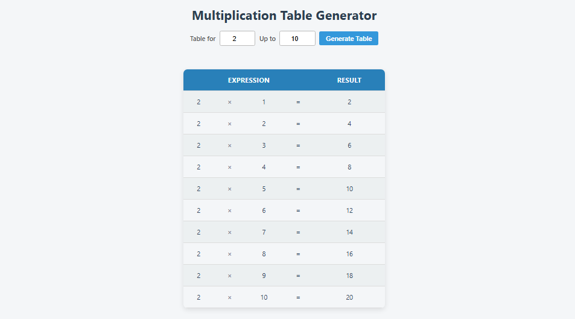

# Multiplication Table Generator

A simple web app that generates multiplication tables for any number from 1 to 10,000, allowing users to customize the table's range. Ideal for students, educators, or anyone who needs a quick way to view multiplication results.

## Features

- Generate multiplication tables for any number.
- Specify the upper limit (up to 100) for the multiplication table.
- User-friendly interface with clear inputs and a neatly formatted table display.
- Input validation to ensure correct data entry.
  
## Demo
For live demo [ckick here](https://muhammad-aqib-bashir.github.io/table-writer/) or can use link below
```markdown
https://muhammad-aqib-bashir.github.io/table-writer/
```

## How It Works

1. **Input the number** for which you want the multiplication table.
2. **Specify the range** (up to 100) for the multiplication table.
3. **Click "Generate Table"** to instantly display the table.

## Installation

To use the app locally, follow these steps:

1. **Download or Clone the Repository**:
   ```bash
   git clone https://github.com/Muhammad-Aqib-Bashir/table-writer.git
   ```
   
2. **Open the `index.html` file** in your browser:
   - You can directly open the `index.html` file in any modern web browser like Chrome, Firefox, or Edge.

3. **Run the app**:
   - No server is required for basic functionality; just open the file in your browser to begin using the app.

## Usage

1. Open the app in your browser.
2. Enter the **number** for the multiplication table.
3. Set the **upper limit** (up to 100).
4. Press the **"Generate Table"** button to see the results displayed below.

## Technologies Used

- **HTML5**: Structure of the web page.
- **CSS3**: Styling and design.
- **JavaScript**: Logic for generating the multiplication table dynamically.
  
## Demo Screenshots



## Contributing

If you'd like to contribute to this project, feel free to fork the repository, create a new branch, make your changes, and submit a pull request. All contributions are welcome!

### Steps to contribute:

1. Fork the repository.
2. Create a new branch.
3. Make your changes.
4. Submit a pull request with a description of your changes.

## License

This project is licensed under the MIT License - see the [LICENSE](LICENSE) file for details.
